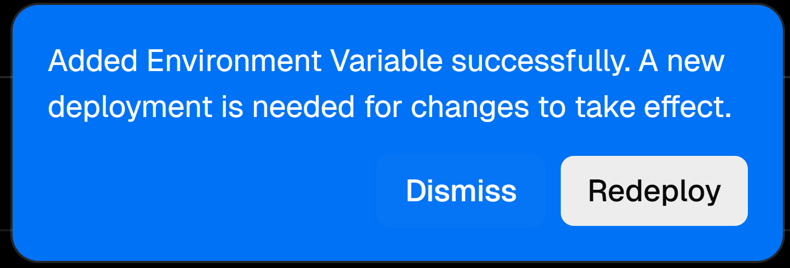

# PCL Intelligence Homepage

一个可以在 PCL2 启动器上使用 Google Gemini 或其他大模型的主页。

> [!CAUTION]
> - 项目仍在开发中，可能会出现不稳定的现象。
> - 本项目仅供学习交流，请在遵守当地法律法规的情况下使用。中国大陆用户请勿输入政治敏感等违法内容。

## 部署方法

### 前言

> [!WARNING]
> 1. 目前仅对 Vercel 和 Gemini Model 进行适配，如需使用自己的服务器与其他模型，请自行修改对应文件。
> 2. 请务必按照以下指示部署你的 PCL Intelligence Homepage，不当的操作可能会导致你的 API Key 被泄露。
> 3. 当前操作会导致**后续更新无法及时推送到你 Fork 后的仓库内**，请慎重考虑。
> 4. 请关注 Vercel Usage 使用情况（位于 [Vercel 主菜单](https://vercel.com) 左侧），需重点关注 `Fluid Active CPU` 和 `Edge Requests` 使用量。不要用超了。更多 Usage Limit 请查看主菜单横条上的 `Usage` 选项。

### 速率限制

以下是来自 Google AI 文档中 **免费计划** 的 API 速率限制 [[原版文档]](https://ai.google.dev/gemini-api/docs/rate-limits)：

| 模型                | 每分钟请求数  | 每分钟输入数（令牌）       | 每日请求数   |
|----------------------|------|-----------|-------|
| Gemini 2.5 Pro       | 5    | 250,000   | 100   |
| Gemini 2.5 Flash     | 10   | 250,000   | 250   |
| Gemini 2.5 Flash-Lite| 15   | 250,000   | 1,000 |
| Gemini 2.0 Flash     | 15   | 1,000,000 | 200   |
| Gemini 2.0 Flash-Lite| 30   | 1,000,000 | 200   |

### 需求
- 一个 [Vercel](https://vercel.com/signup) 账号：用于部署主页后端。
- [Google AI Studio API 密钥](https://aistudio.google.com/apikey)（香港地区不支持访问 Google AI Studio）：用于请求模型。
    - 如需请求多个 API Key 用于后续的多 API Key 模式，请从[https://console.cloud.google.com/projectcreate](https://console.cloud.google.com/projectcreate) 创建多个项目，后在 AI Studio 中创建 API Key。遇到问题请自行 Google。

### 部署
1. [Fork 本仓库](https://github.com/Ad-closeNN/PCL-Intelligence-Homepage/fork) ，点击 **Create Fork** 按钮即可 Fork。
2. 将可见性改为 **私密**。
    1. 在仓库顶端点击 **Settings**。
    2. 滑至底部，点击 **Leave fork network** 按钮并确认操作。 
    3. 等待10至30秒，使 Fork 后的仓库脱离 Fork 网络。
    4. 刷新页面，待 **Danger Zone** 里的 **Change visibility** 按钮可用后，点击 **Change visibility** 按钮并确认操作。 
3. 更改 config/api_key 文件，删掉原有内容，把从 [Google AI Studio](#需求) 申请的 API Key 以 **一行一个 Key** 的格式填入。
4. 使用 Vercel 部署：[Create New Project](https://vercel.com/new)

    需要填写相关变量:
    - 如果使用**单个 API 密钥**（如需使用多个 API 密钥，请勿填写此变量）：
        - Env Name: `api_key`
        - Env Value: `你的 API 密钥`
    - 如果使用**多个 API 密钥**，**不能填写**上面的 `api_key`：
        - Env Name: `mode`
        - Env Value:
            - `local`：本地获取 API Key，位于 config/api_key，一行一个 API Key。
            - URL 链接：如 `https://google-api-key.pclc.cc`，**必须以 http 开头**，返回的内容需为**单个 API Key**。
    - 请求地址（即部署后的主页按下按钮请求的链接，填写 Vercel 部署后的链接）:
        - Env Name: `link`
        - Env Value：域名或 IP 地址，**必须以 http 开头**
        
> [!NOTE]
> （填写变量 `link` ）如果不知道怎么操作，请按照下列指示操作：
> 1. 先不填这个变量 `link`。但是上面 `api_key` 或 `mode` **需填**（二选一），填完**直接部署**。
> 2. 部署完成后可根据步骤5、6的可选步骤优化部署。
> 3. 来到 Vercel 项目的 **Settings**，在左侧菜单选择 **Environment Variables**。
> 4. `Key` 填入 `link`；`Value` 填入 **部署后的链接（优先选有绑定好的自定义域名）**（如`https:/url.pcl-community.org` 或 `https://pih.vercel.app`）。**必须带上协议！** 如 `http://` `https://`。
> 5. 点击 `Save` 按钮，保存变量。
> 6. 点击右下角弹出的 `Redeploy` 按钮，重新部署 

> [!WARNING]
> 如果你把 `api_key` 和 `mode` 都填了，其使用的顺序为 `mode`>`api_key`（也就是优先使用多个 API Key）。
>
> 如果你什么都不填，或者 `mode` 填的不是 `local` 或 以`http`开头的链接，会报 **500 内部服务器错误**。

5. （可选、**建议**）在 Vercel 绑定自定义域名（中国大陆网络连接 `vercel.app` 比较困难）。
6. （可选、**不建议**）对 Vercel Anycast IP 进行优选。[LINUX DO 文章](https://linux.do/t/topic/128871)
7. 在 PCL2 启动器选择 `联网更新`，输入从 Vercel 部署的根 URL，例如 `https://abc.vercel.app` 或 `https://intelligence.pcl-community.org`。

## 开源项目

此项目使用到了以下项目：

- [Light-Beacon/HomepageBuilder](https://github.com/Light-Beacon/HomepageBuilder) （本项目已对其进行部分更改，已使用相同的开源许可证 **AGPL-3.0 License**）
    - 本项目使用的更改后的同许可证源代码可在 [Ad-closeNN/HomepageBuilder](https://github.com/Ad-closeNN/HomepageBuilder) 查看

- [Google Fonts - Material Symbols & Icons](https://fonts.google.com/icons)

## TODO

- 优化加载速度
- 修复安装包时，多个请求可能会重复安装的问题

---

~~不管了能用就行~~ 如果有大佬们能改进的地方，欢迎 PR